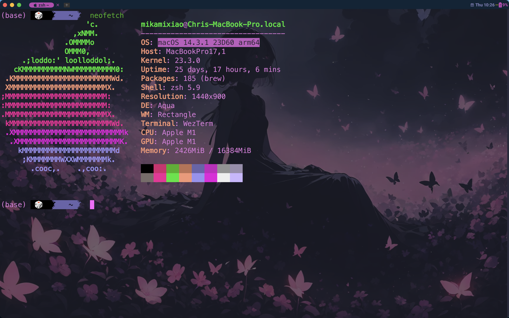

# My Wezterm Config for MacOS 14.3.1 arm64

**Screenshot**

 

## Original Authors

- <https://github.com/KevinSilvester/wezterm-config>
- <https://github.com/QianSong1/wezterm-config>

## Requirements

- [WezTerm Terminal](https://github.com/wez/wezterm/releases)
- Necessary fonts
  - [Nerd Font Symbol](https://www.nerdfonts.com/)
  - [JetBrains Mono](https://www.jetbrains.com/lp/mono/)
  - [Noto Color Emoji](https://fonts.google.com/noto)

## Usage
1. Open ```wezterm``` GUI
2. Copy and paste
```bash
mkdir ~/.config/wezterm
git clone https://github.com/mikami520/wezterm-config-mac.git ~/.config/wezterm
```
```wezterm``` will automatically reload the new configuration. You can also DIY by editing the files in the ```~/.config/wezterm/config``` folder


## Relative Links

- <https://github.com/rxi/lume>
- <https://github.com/catppuccin/wezterm>
- <https://github.com/wez/wezterm/discussions/628#discussioncomment-1874614>
- <https://github.com/wez/wezterm/discussions/628#discussioncomment-5942139>
- <https://github.com/wez/wezterm/discussions/628#discussioncomment-3649195>
